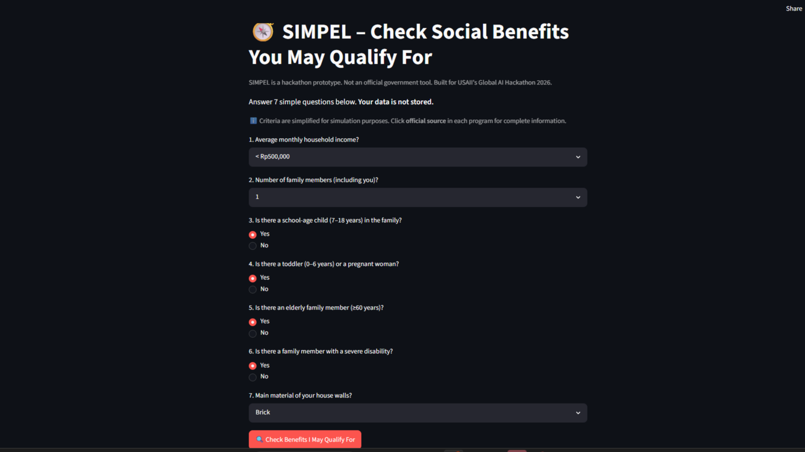
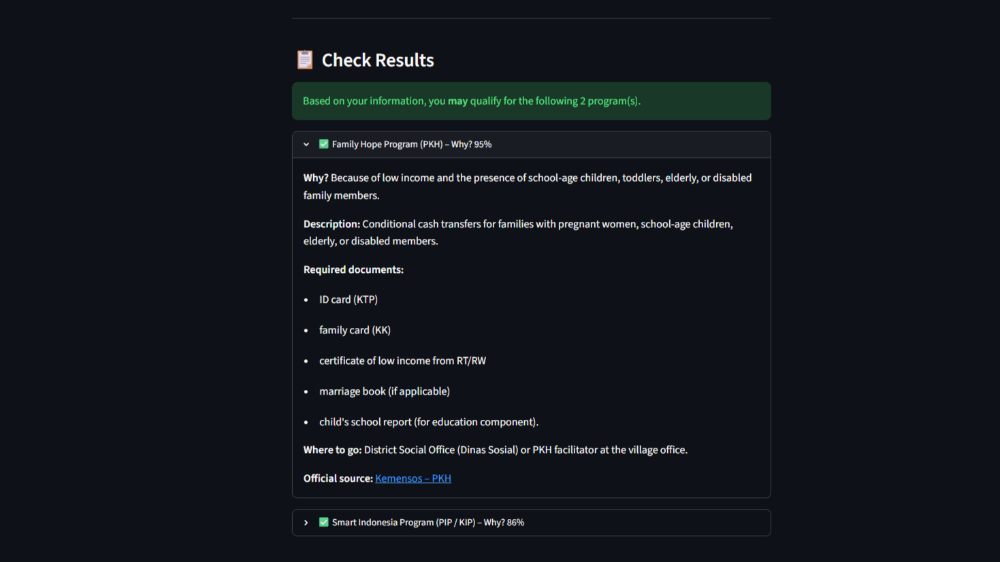
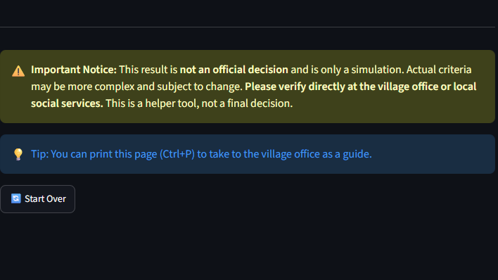
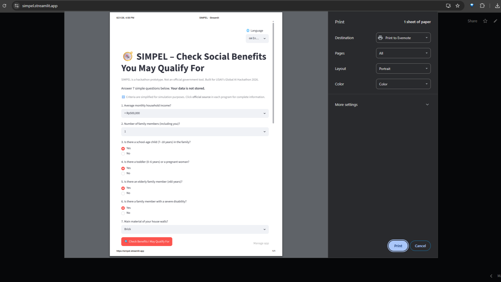
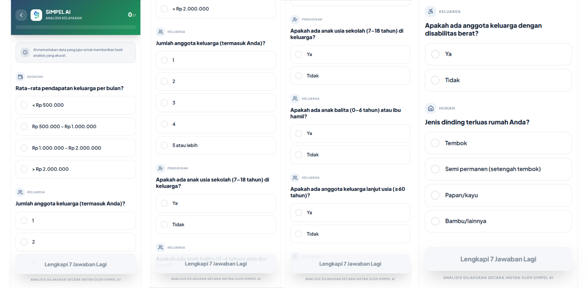
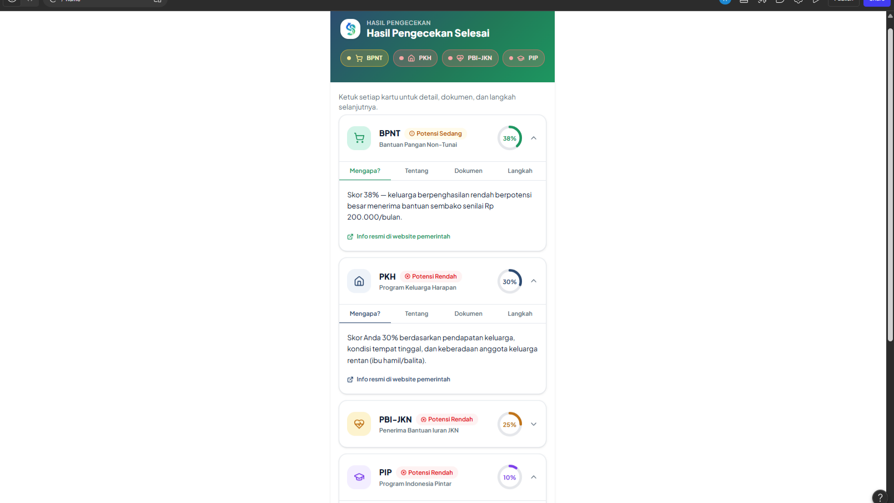
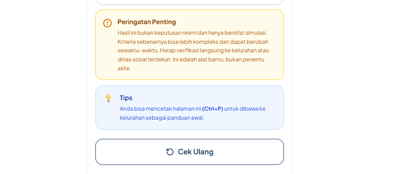
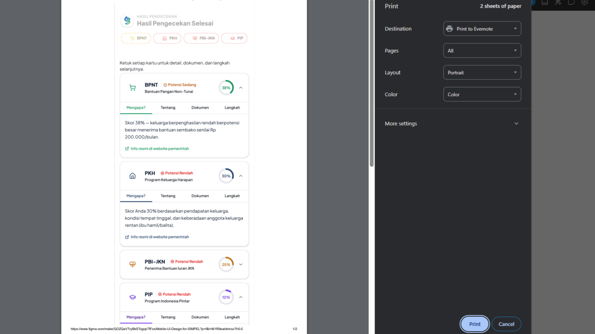

# 📸 SIMPEL – Documentation & Screenshots

This folder contains the **visual documentation** of the SIMPEL application for the USAII 2026 hackathon submission.

---

## 🖼️ Screenshots

### 🌐 Live App (Streamlit)

#### 1. Question Screen

*The 7‑question intake form in the live Streamlit app (Bahasa Indonesia). Users select answers via dropdowns and radio buttons — no typing required.*

#### 2. Results Screen (Expanded)

*After clicking "Cek Bantuan", the app displays predicted programs with confidence scores, plain‑language reasons, required documents, and office locations. Cards can be expanded individually.*

#### 3. Disclaimer Banner

*Persistent yellow warning at the bottom of every result: "Ini bukan keputusan resmi. Harap verifikasi ke kelurahan atau dinas sosial terdekat." This reinforces that the AI only suggests — it never decides.*

#### 4. Print Preview

*The page is print‑friendly. Users can press Ctrl+P to get a physical checklist to bring to the village office. The disclaimer remains visible in print.*

---

### 🎨 Figma Prototype

#### 1. Question Screen (Mockup)

*Mobile‑first Figma mockup of the 7‑question form. Designed for clarity and accessibility on small screens.*

#### 2. Results Screen (Mockup)

*Figma design of the results view, showing expandable cards, confidence meter, and document checklist.*

#### 3. Disclaimer Banner (Mockup)

*The yellow disclaimer as designed — always visible, never dismissible.*

#### 4. Print Layout (Mockup)

*Design of the print‑friendly output, ensuring the checklist and disclaimer remain intact on paper.*

---

## 🎯 Logo Documentation

The SIMPEL logo combines a compass‑like mark with the project name. It is used in the app header, the README, and the pitch deck. The design emphasizes navigation, simplicity, and forward direction — reflecting the mission to guide families through a confusing benefits system.

---

## 📊 Pitch Deck Presentation

**LINK:** [Pitch Deck (Google Slides)](https://docs.google.com/presentation/d/14Uo2NjJu1JA7-NlhcA9yM1STi1OoK5PhIQ_-ge7E010/edit?usp=sharing)

**FILE:** [Pitch Deck (PDF)](screenshots/SIMPEL%20-%20AI%20Benefits%20Navigator.pdf)
The pitch deck consists of **7 slides**:

1. **Welcome to SIMPEL** – project title, tagline, and four target programs.
2. **The Information Accessibility Crisis** – 8 million families left out, root causes.
3. **SIMPEL – Inclusive Social Navigation** – the 7‑question flow, kader‑friendly design.
4. **Interpretable ML vs. Rigid Rules** – Random Forest architecture, balanced training data.
5. **Responsible AI & Fairness Debugging** – false‑positive fix, confidence capping, privacy.
6. **User‑Centered Design in Action** – storyboard of the user journey with screenshots.
7. **Scale, Impact, and Future Roadmap** – voice input, offline PWA, DTKS integration, guardrailed chatbot.

Each slide is designed in dark mode with Tech Green and Alert Yellow accents. The deck is used in the 3‑5 minute pitch video.

---

## 🛡️ Responsible AI in the UI

- **Confidence scores** are displayed as percentages but capped at **95%** — never 100%.  
- The app uses **“mungkin” (may qualify)** language exclusively; it never states “Anda berhak” or “pasti”.  
- A **yellow disclaimer** is always visible, not dismissible.  
- The final decision is explicitly deferred to **government officers at the kelurahan** — human‑in‑the‑loop is mandatory.

---

*For technical details, model evaluation, and the full project README, please see the [main README](../README.md).*